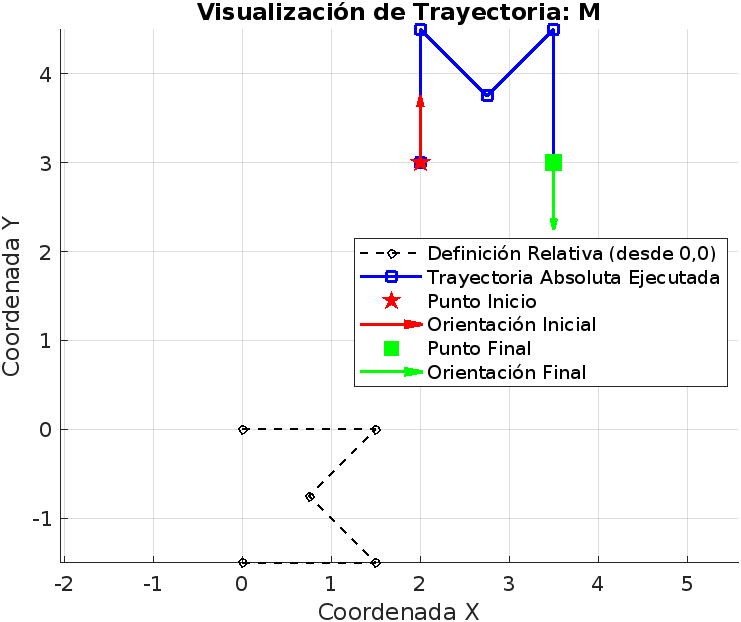
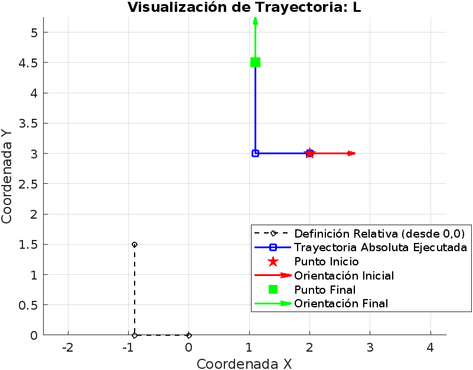

# 🐢 ROS2 TurtleSim Shape Drawer

Este proyecto permite controlar una tortuga de **Turtlesim** en ROS2 usando el teclado, con funcionalidades adicionales para que la tortuga dibuje letras en pantalla como `M`, `A`, `L`, `O`, `C`, `D` y `S`. ¡Una manera divertida de interactuar con Turtlesim y practicar control de robots en ROS2!

---

## 📦 Requisitos

- Python 3
- ROS2 Humble
- Paquete `turtlesim` instalado
- Terminal compatible con entrada de teclas sin eco (ej. terminal de Linux o macOS)

---

## 🚀 Instalación y Ejecución

1. **Configura tu espacio de trabajo ROS2**

   ```bash
   source /opt/ros/humble/setup.bash
   ```

2. **Clona este repositorio** en tu carpeta `src` de tu workspace:

   ```bash
   cd ~/ros2_ws/src
   git clone <URL-del-repositorio>
   cd ~/ros2_ws
   colcon build
   source install/setup.bash
   ```

3. **Lanza el simulador de la tortuga** en un terminal:

   ```bash
   ros2 run turtlesim turtlesim_node
   ```

4. **Ejecuta el controlador** en otro terminal:

   ```bash
   ros2 run my_turtle_controller move_turtle
   ```

---

## 🎮 Controles de Teclado

### Movimiento Manual

| Tecla         | Acción                      |
|---------------|-----------------------------|
| ↑ (flecha arriba)    | Avanzar               |
| ↓ (flecha abajo)     | Retroceder            |
| ← (flecha izquierda) | Girar a la izquierda  |
| → (flecha derecha)   | Girar a la derecha    |
| `+`           | Aumentar velocidad lineal y angular |
| `-`           | Disminuir velocidad lineal y angular |

### Dibujo de Letras

Presiona una de las siguientes teclas para iniciar el trazado de la letra correspondiente. Durante el dibujo, puedes presionar `q` para interrumpir.

| Tecla | Letra | Descripción              |
|-------|-------|--------------------------|
| `m`   | M     | Dibuja la letra 'M' mediante segmentos rectos.|  
| `a`   | A     | Dibuja la letra 'A' con forma correcta y giro inicial.|  
| `l`   | L     | Dibuja la letra 'L' con movimiento vertical y horizontal.|  
| `o`   | O     | Dibuja la letra 'O' como un círculo completo.|  
| `c`   | C     | Dibuja la letra 'C' como un arco mayoritario.|  
| `d`   | D     | Dibuja la letra 'D' combinando línea vertical y arco.|
| `q`   | Q     | Salir del programa       |

---

## 🧩 Descripción de Clases y Módulos

### `ShapeGenerator`

- **Propósito**: Proporciona métodos para generar curvas y rotar puntos y formas.
- **Métodos clave**:
  - `rotate_point(point, angle)`: Rota un punto `(x, y)` por un ángulo dado.
  - `generate_arc_segments(radius, start_angle, end_angle, num_segments)`: Devuelve segmentos relativos que describen un arco de círculo.
  - `rotate_shape(points, angle)`: Rota una lista de puntos relativos por un ángulo.

### `LetterShapes`

- **Propósito**: Define las trayectorias relativas de cada letra que la tortuga debe seguir.
- **Constructor**:
  - `base_scale`: Escala general de las letras.
  - `num_arc_full` y `num_arc_part`: Número de segmentos para arcos completos y parciales.
- **Atributos**:
  - `self.shapes`: Diccionario que asocia cada letra (`'m'`, `'a'`, etc.) con una lista de segmentos relativos `(dx, dy)`.

### `KeyboardControllerNode` (subclase de `rclpy.node.Node`)

- **Propósito**: Nodo central que maneja la entrada de teclado, publica comandos de velocidad y controla el dibujo de formas.
- **Atributos importantes**:
  - `cmd_pub`: Publicador de mensajes `Twist` en `/turtle1/cmd_vel`.
  - `pose_sub`: Suscriptor a `/turtle1/pose` para obtener la posición actual.
  - `shape_bindings`: Mapeo de teclas a las formas definidas en `LetterShapes`.
  - `speed`, `turn`: Velocidades base lineal y angular.
  - `drawing`, `interrupt`: Flags para controlar la ejecución de dibujo y posibles interrupciones.
- **Métodos clave**:
  - `keyboard_loop()`: Bucle que captura y procesa pulsaciones de teclas.
  - `execute_trajectory(rel_points)`: Convierte puntos relativos en metas absolutas y las recorre.
  - `move_to_goal(gx, gy)`: Control proporcional (P-control) para mover la tortuga hasta `(gx, gy)`.
  - `pose_cb(msg)`: Callback para actualizar la posición actual de la tortuga.
  - `publish(lin, ang)`: Publica una velocidad lineal y angular.

### Funciones Auxiliares

- `normalize_angle(a)`: Normaliza un ángulo para que quede entre `-π` y `π`.
- `print_current_speeds(spd, trn)`: Imprime en consola las velocidades actuales.

---

## ⚙️ Flujo de Ejecución

1. `main()`: Guarda la configuración de terminal, inicializa ROS2 y crea la instancia de `KeyboardControllerNode`.
2. Se lanza ROS2 y se espera la primera pose de la tortuga.
3. El hilo `keyboard_loop` captura pulsaciones, envía comandos inmediatos o lanza hilos de dibujo.
4. Para cada letra, `execute_trajectory` calcula metas y usa `move_to_goal` para un trazado suave.
5. Se puede interrumpir el dibujo con `q` o usar flechas para control manual en cualquier momento.

---

## Preparación de Trayectorias
La estrategia fundamental para dibujar las formas (letras) es definirlas como una secuencia de movimientos relativos. Cada forma se almacena como una lista de vectores (dx, dy). Cada vector indica cuánto debe moverse la tortuga en sus ejes X (adelante/atrás) e Y (izquierda/derecha) locales para alcanzar el siguiente punto clave de la forma, partiendo desde donde terminó el movimiento anterior.

El proceso se puede dividir en varias etapas clave:
### Etapa 1: Definición de la Trayectoria como Vectores Relativos:

Cada forma se define como una secuencia de movimientos relativos al punto anterior 

- **Representación:** Para ello usamos una  lista de tuplas (dx, dy), donde cada tupla representa un segmento de la trayectoria. dx es el cambio en la coordenada X y dy es el cambio en la coordenada Y para ese segmento específico. 

```python
 # Forma 'A'

        a_scale = base_scale
        a_height = 1.0 * a_scale
        a_width = 1.0 * a_scale
        self.a_shape_relative = [
             (a_width / 2.0, a_height),
             (a_width / 2.0, -a_height),
             (-a_width / 4.0, a_height / 2.0),
             (-a_width / 2.0, 0.0)
        ]

```
- **Escalado:**  Se usa una variable base_scale para ajustar el tamaño general de las formas de manera consistente. Las definiciones multiplican las dimensiones base por esta escala. 

### Como definimos estas taryectorias?

- `De forma directa`: Para formas compuestas por líneas rectas (como 'M', 'A', 'L'), las tuplas (dx, dy) se escriben directamente en el código, calculadas a partir de las dimensiones deseadas (altura, anchura)


- `Generacion de arcos`:
Para formas curvas ('O', 'C', 'D'), no es práctico definir manualmente cada segmento. Se usa la función **generate_arc_segments**.
Lo que queremos es aproximar un arco circular mediante una secuencia de pequeños segmentos rectos (vectores relativos)

    **Parámetros:**

    - `radius`: El radio del arco.  
    - `start_angle_rad`: El ángulo (en radianes) donde comienza el arco en un círculo centrado en (0,0).  
    - `end_angle_rad`: El ángulo (en radianes) donde termina el arco.  
    - `num_segments`: En cuántos pequeños segmentos rectos se dividirá el arco. Más segmentos = curva más suave pero más puntos a procesar.

        ```python
        # Ejemplo: Generación de la 'O' original (círculo completo)
        o_radius = 0.7 * base_scale
        o_shape_orig = self.generate_arc_segments(
            o_radius, math.pi, 3 * math.pi, num_arc_segments_full 
        )
        ```
        `Resultado`: Devuelve una lista de tuplas (dx, dy) que, si se suman consecutivamente, aproximan el arco deseado.

- `Combinación de Segmentos`: Formas como la 'D' combinan segmentos rectos y curvos. Se definen por separado y luego se concatenan sus listas de vectores relativos.

    ```python
            d_line = (0.0, d_height) # Vector recto inicial
            d_arc_segments = self.generate_arc_segments(...) 
            d_shape_orig = [d_line] + d_arc_segments # Se unen las listas

    ``` 

### Etapa 2: Pre-Rotación de Definiciones

Algunas formas (como 'O', 'C', 'D') se generan con una orientación "natural" basada en los ángulos usados en generate_arc_segments. Sin embargo, se desea que al presionar la tecla, la tortuga comience a dibujar la forma moviéndose "hacia adelante" (en la dirección de su eje X local). Para lograr esto, estas definiciones se pre-rotan antes de ser almacenadas.
Usamos `rotate_shape_definitionrotate_shape_definition`

**Parámetros:**

- `relative_points`: La lista original de vectores (dx, dy) a rotar.  
- `angle_rad`: El ángulo (en radianes) que se desea rotar la definición completa.

```python
angle_to_align_with_x = -math.pi / 2.0
self.o_shape_relative = self.rotate_shape_definition(o_shape_orig, angle_to_align_with_x)
self.c_shape_relative = self.rotate_shape_definition(c_shape_orig, angle_to_align_with_x)

```

### Etapa 3: Almacenamiento de las Definiciones Finales:

Las listas finales de vectores relativos (algunas pre-rotadas, otras no) se almacenan en un diccionario llamado shape_bindings.

```python 
self.shape_bindings = {
    'm': self.m_shape_relative,
    'a': self.a_shape_relative,
    'o': self.o_shape_relative, # Contiene la definición ya pre-rotada
    # -----
}
```
Esto permite seleccionar fácilmente la "plantilla" correcta cuando el usuario presiona una tecla.

### Etapa 4: Preparación para la Ejecución (Cálculo de Puntos Objetivo Absolutos)
 Después de que el usuario presiona una tecla de forma válida (ej: 'm') y antes de que el robot empiece a moverse realmente. Se realiza dentro de la función `execute_trajectory`.

 Disparador: El keyboard_loop detecta una tecla válida (ej: 'm'), busca la lista de vectores relativos correspondiente en `shape_bindings`, y lanza un hilo (thread) para ejecutar `execute_trajectory` pasándole esa lista.

Algo crucial dentro de execute_trajectory es obtener la pose actual del robot **(posición y orientación)** en el momento en que se inicia el dibujo. 

```python
start_pose = self.get_current_pose_safe()
# start_pose contiene .x, .y, .theta (ángulo actual de la tortuga)
start_angle = start_pose.theta
current_x, current_y = start_pose.x, start_pose.y
```

### Etapa 5 .Calcular Objetivos Absolutos

- Se rota cada vector relativo `(dx, dy)` por el ángulo inicial `start_angle`.
- Se suma el vector rotado a la última posición absoluta calculada para obtener el siguiente punto objetivo `(X, Y)`.
- Se guarda el punto `(X, Y)` en `absolute_goals`.

Un paso intermedio es verificar si este (goal_x, goal_y) calculado está dentro de los límites permitidos del canvas de Turtlesim (`check_boundaries`). Si no, la trayectoria se invalida.

### Etapa 6  Listo para Seguir: 

 La lista ```absolute_goals``` está completa y lista para ser pasada (elemento por elemento) a la lógica de control de movimiento (move_to_goal). 

Para ilustrarlo de forma más clara, utilizamos MATLAB y extraímos varias de las funciones clave del proceso de generación de la trayectoria, encapsulándolas en un script que muestra únicamente la parte esencial previamente descrita.

En este ejemplo dibujaremos las letras asumiendo que la tortuga se encuentra en la posición x=2x=2, y=3y=3, orientada a 45 grados y utilizando una escala de 1.5, cada vez que se presione la tecla correspondiente.

```Letra A:```


[LetraA_r_45.webm](https://github.com/user-attachments/assets/bc5d2df5-a225-4462-81d3-45f9fbeaff7e)

Ahora el angulo va hacer -$\pi$


Letra M a $\pi/2$



[LetraM.webm](https://github.com/user-attachments/assets/8a5969aa-182b-4df7-acf8-55fc376a94e3)


Letra L



[LetraL.webm](https://github.com/user-attachments/assets/8d5a4803-6c48-405c-8f46-beeb63200227)


Ahora Por ejemplo Probemos la letra C que es curva:


Ahora veamos a $\pi/2$


[LetraC.webm](https://github.com/user-attachments/assets/5e6b93f1-5d03-4309-b66e-a244579ccc4a)


Tenemos la letra O :


[LetraO.webm](https://github.com/user-attachments/assets/cae7aacd-f550-44ab-9113-e338aa003cb8)

Letra S:

[LetraS.webm](https://github.com/user-attachments/assets/34e84d91-3634-4bf3-9b15-934e0f25630e)


Esta es la idea general del proceso. Finalmente, dibujaremos la letra D, que combina una parte curva y una parte recta. Con estas tres letras ya podríamos cubrir de manera general el abanico de formas presentes en el abecedario.

Orientada a 0 grados


Orientada a 90 grados:


[LetraD.webm](https://github.com/user-attachments/assets/12e7ac4f-bc0f-47b7-9ec5-257cdd2085f0)


## Diagramas de clases y de flujo 
### Descripción del Diagrama de Clases

- **ShapeGenerator**: Métodos estáticos para rotar puntos y generar/rotar arcos.
- **LetterShapes**: Inicializa vectores relativos de cada letra (M, A, L, O, C, D, S).
- **KeyboardControllerNode**:  
  - Publica `Twist` y suscribe `Pose`.  
  - Captura teclas, ajusta velocidad, mueve manualemente o dibuja formas.
  - Métodos claves: `keyboard_loop()`, `execute_trajectory()`, `move_to_goal()`.

---



```mermaid
classDiagram
    %% Clases externas de ROS
    class Node 
    class Twist 
    class Pose 

    %% Generador de formas básicas
    class ShapeGenerator {
      +static rotate_point(point, angle): (float, float)
      +generate_arc_segments(radius, start_angle, end_angle, num_segments): List
      +rotate_shape(points, angle): List
    }

    %% Definición de las formas de cada letra
    class LetterShapes {
      +m: List
      +a: List
      +l: List
      +o: List
      +c: List
      +d: List
      +s: List
      +shapes: Map
      +__init__(base_scale=1.5, num_arc_full=32, num_arc_part=24)
    }

    %% Nodo principal de control de teclado
    class KeyboardControllerNode {
      -settings
      -cmd_pub: Publisher
      -pose_sub: Subscription
      -current_pose: Pose
      -pose_lock: Lock
      -speed: float
      -turn: float
      -manual_x: float
      -manual_th: float
      -drawing: bool
      -interrupt: bool
      -thread: Thread
      -shape_bindings: Map
      -key_thread: Thread
      +__init__(settings)
      +pose_cb(msg: Pose)
      +wait_for_pose()
      +publish(lin, ang)
      +keyboard_loop()
      +execute_trajectory(rel_points)
      +move_to_goal(gx, gy): bool
      +destroy()
    }

    %% Relaciones
    KeyboardControllerNode --|> Node
    KeyboardControllerNode ..> Twist
    KeyboardControllerNode ..> Pose
    KeyboardControllerNode ..> LetterShapes
    KeyboardControllerNode ..> ShapeGenerator
    LetterShapes ..> ShapeGenerator
```

### Descripción del Diagrama de Flujo

1. **Inicio**: Init ROS, `wait_for_pose()`, mostrar ayuda.  
2. **Bucle de teclado**: Detecta teclas → mueve, ajusta velocidad, dibuja o sale.  
3. **Dibujo**:  
   - Calcula metas desde vectores.  
   - Para cada meta, ejecuta control proporcional (`move_to_goal`).  
4. **Cierre**: Destruye nodo, detiene tortuga y restaura terminal.

```mermaid
flowchart TD
    %% Inicio del programa
    Start([Start]) --> Init[Initialize ROS & Node]
    Init --> WaitPose[wait_for_pose]
    WaitPose --> PrintHelp[Print speeds & help message]
    PrintHelp --> KeyboardLoop[Launch keyboard loop]

    %% Bucle principal de teclado
    subgraph MainLoop [Keyboard Loop]
      KeyboardLoop --> KeyCheck{Key press?}
      KeyCheck -->|No key| Idle[Check manual_x/manual_th → publish 0]
      KeyCheck -->|Arrow key| ManualMove[Publish manual velocity]
      KeyCheck -->|+ or -| AdjustSpeed[Adjust speeds & print]
      KeyCheck -->|Letter key| DrawStart[Spawn execute_trajectory thread]
      KeyCheck -->|q| Quit[Break loop]
      Idle --> KeyboardLoop
      ManualMove --> KeyboardLoop
      AdjustSpeed --> KeyboardLoop
      DrawStart --> KeyboardLoop
      Quit --> Shutdown[Exit loop]
    end

    %% Subproceso de dibujo de formas
    subgraph Drawing [execute_trajectory]
      DrawStart --> ComputeGoals[Compute absolute goal points]
      ComputeGoals --> ForEach[For each goal point]
      ForEach --> MoveToGoal[move_to_goal gx, gy]
      MoveToGoal --> CheckDone{Reached? or Interrupted?}
      CheckDone -->|Yes & more pts| ForEach
      CheckDone -->|Interrupted/Fail| Abort[Abort drawing]
      CheckDone -->|All reached| Complete[Finish drawing]
      Abort --> EndDraw[Set drawing=false]
      Complete --> EndDraw
      EndDraw --> Return[Return to Keyboard Loop]
    end

    %% Cierre del programa
    Shutdown --> Cleanup[Destroy node & shutdown ROS]
    Cleanup --> Restore[Restore terminal settings]
    Restore --> End([End])

```




## 📌 Notas y Consejos

- **Enfoque de la terminal**: Asegúrate de estar en la terminal desde la cual se lanzó el nodo para poder ejecutar sus funciones correctamente.
- **Límites de área**: Si un punto meta está fuera de `[0+0.1, 11-0.1]` en `x` o `y`, se detiene el dibujo.
- **Velocidades**: Ajustar con `+` y `-` en tiempo real según la precisión deseada.

---

## 🐛 Contribuciones y Feedback

¡Tu colaboración es bienvenida! Si encuentras errores o tienes sugerencias, abre un _issue_ o envía un _pull request_.

---

## 📄 Licencia

Este proyecto está bajo la licencia **MIT**. ¡Siéntete libre de usarlo y adaptarlo!

